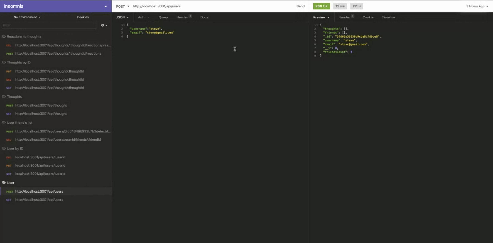

# Challenge-18-nosql-social-media-api

## Tools Used

* JavaScript
* Node.js
* Express
* Mongodb
* Mongoose
* Dotenv

# Summary

# Description
This app allows users to log in, sign up, connect to 4 different chat rooms, & leave room.

# Table of Contents 
* [Description](#Description)
* [Installation & Database SetUp](#Installation)
* [Walk-through-Video](#Walk-through)
* [Usage](#usage)
* [License](#license)
* [Contributing](#contributing)
* [Tests](#tests)
* [Questions](#questions)

# Installation & Database SetUp
* To use this app npm init has to be called to create your package.json file.
* The following necessary Npm dependencies must be installed to run the application properly: the needed dependencies will be found on the package.json file.
* To properly install the database you must install MySQL on your computer, create an profile in which you have a root and a password.
* In your command line you must type mysql -u root -p and then enter, type your password that you created on MySQL on the following line.
* To finally add the database you must do the following: source db/schema.sql then enter.
* Run "npm start" for the port to start listening.
* If on Heroku, all you have to do is login.

# Walk-through Video

# Usage
In order to use this app on VS, install the node dependencies shown on package.json. Run the app in the terminal on VS Code use npm start. Or can check the app live on Heroku.

# License

# Contributing
​Contributors: N/A

# Tests
N/A

# Questions?
## Please contact me:
  * [My GitHub Profile](https://github.com/jcgom3)
  * [My Github Project Repository](https://github.com/jcgom3/)
  * [My Github Deployed IO](https://jcgom3.github.io/)
  * Email us at: [Jcgom3@gmail.com](mailto:Jcgom3@gmail.com) with questions or make an issue about this project.